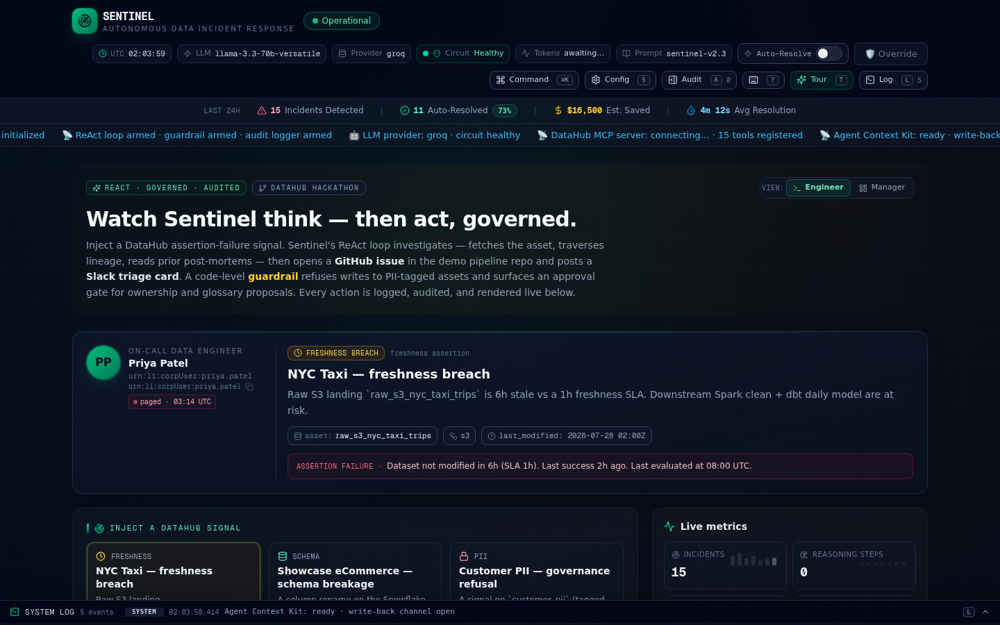

<div align="center">

# Sentinel

### Every incident leaves the catalog smarter.

[](./LICENSE)
[](./.github/workflows/ci.yml)
[](https://nextjs.org/)
[](https://www.typescriptlang.org/)
[](https://datahub.devpost.com)
[](https://youtu.be/gpPB2UNSTPA)

**The autonomous data-incident agent for DataHub.**

**Source:** [sodiq-code/sentinel](https://github.com/sodiq-code/sentinel) · **Live demo:** [sentinel-ivory-two-79.vercel.app](https://sentinel-ivory-two-79.vercel.app) — Challenge 1, *Agents That Do Real Work*

</div>

<div align="center">

### ▶ Watch the 3-minute demo

[](https://youtu.be/gpPB2UNSTPA)

*Every incident leaves the catalog smarter. Run 1 writes. Run 2 reads. Each run compounds.*

</div>

---

Sentinel is the autonomous agent that **closes the loop** on data incidents. When DataHub trips a freshness, schema, or quality signal, Sentinel triages the failing asset, opens the GitHub issue and Slack triage card an on-call engineer would have opened, then writes a structured post-mortem back into DataHub — so the next incident on that asset starts where the last one ended.

**The post-mortem it writes in Run 1 is the context it reads in Run 2.** Each run compounds. The catalog doesn't just record failures — it learns from them.

This runs live: real GitHub issues, real Slack posts, real DataHub write-backs — under a code-level guardrail that refuses destructive actions and gates governance writes behind human approval. The LLM cannot bypass it by rephrasing. [Proof below.](#verified-end-to-end)

> 🔄 **Closed loop** — Run 1's post-mortem is Run 2's context · ✅ **Live proof** — 2 GitHub issues, 2 Slack cards, 1 post-mortem persisted to DataHub · 🛡️ **Code-level guardrail** — refuses PII writes, never merges PRs · ⚡ **Groq llama-3.3-70b** + multi-provider failover

<p align="center">
  
</p>

---

## How it works

```
                       DataHub signal (freshness / schema / quality)
                                    │
                                    ▼
                          ┌──────────────────────┐
                          │   Orchestrator       │  ReAct loop
                          │   (orchestrator.ts)  │  (observe → think → act)
                          └──────────┬───────────┘
                                     │
            ┌────────────────────────┼────────────────────────┐
            ▼                        ▼                        ▼
   ┌─────────────────┐    ┌──────────────────┐    ┌────────────────────┐
   │  MCP read tools │    │  Guardrail       │    │  Action tools      │
   │  (DataHub)      │    │  (pre-exec.ts)   │    │  (GitHub, Slack)   │
   │                 │    │                  │    │                    │
   │  get_entities   │    │  PII refusal     │    │  openIssue         │
   │  get_lineage    │    │  No-merge rule   │    │  openPR (never     │
   │  search_docs    │    │  Approval gate   │    │    merged)         │
   │  get_queries    │    │                  │    │  postTriage        │
   └─────────────────┘    └──────────────────┘    └─────────┬──────────┘
                                                            │
                                                            ▼
                                                ┌────────────────────┐
                                                │  Write-back        │
                                                │  (Agent Context    │
                                                │   Kit → DataHub)   │
                                                │                    │
                                                │  post-mortem       │
                                                │  glossary proposal │
                                                │  ownership proposal│
                                                │  SLA assertion     │
                                                └─────────┬──────────┘
                                                          │
                                                          ▼
                                          next incident reads this context
                                              (the compounding beat)
```

---

## Quick start

Runs from a fresh clone in under a minute. No Docker, no live DataHub, no cloud credentials needed — the demo uses a seeded SQLite catalog.

```bash
git clone https://github.com/sodiq-code/sentinel.git
cd sentinel
bun install
bun run db:push          # creates the local SQLite DB + seeded fixtures
bun run dev              # http://localhost:3000
```

Open the dashboard, click **"Inject signal"** (or "Replay loop" for the compounding demo), and watch Sentinel triage → act → write back.

**Live vs dry-run:** a fresh clone defaults to dry-run (`SENTINEL_DRY_RUN=true`) — connectors write to a local trace log, no tokens needed. The [live Vercel deploy](https://sentinel-ivory-two-79.vercel.app) runs with real tokens and fires real actions (see [verified artefacts below](#verified-end-to-end)). The dashboard's **DRY-RUN ↔ LIVE toggle** flips connector mode at runtime without touching `.env` — add your own GitHub + Slack tokens to [`.env.example`](./.env.example) to test live actions from your clone.

---

## Verified end-to-end

✅ **Ran live on 2026-07-30** — 2 GitHub issues · 2 Slack triage cards · 1 post-mortem persisted to DataHub · 23-step ReAct loop. Every row below is a clickable, externally-verifiable artefact.

| Action | Live artefact (click to verify) |
|---|---|
| **GitHub issue (freshness)** | [github.com/sodiq-code/sentinel-demo-pipeline/issues/12](https://github.com/sodiq-code/sentinel-demo-pipeline/issues/12) — state `open`, labels `auto-filed`, `data-ingestion`, `freshness`. |
| **GitHub issue (PII)** | [github.com/sodiq-code/sentinel-demo-pipeline/issues/13](https://github.com/sodiq-code/sentinel-demo-pipeline/issues/13) — labels `auto-filed`, `compliance`, `pii`, `security`. |
| **Slack triage (freshness)** | [sentinel-bot.slack.com/archives/C0BL9CQ4D5G/p1785375809753079](https://sentinel-bot.slack.com/archives/C0BL9CQ4D5G/p1785375809753079) — Block Kit card posted by `sentinel_bot2`. Requires workspace membership to view. |
| **Slack triage (PII)** | [sentinel-bot.slack.com/archives/C0BL9CQ4D5G/p1785375873722729](https://sentinel-bot.slack.com/archives/C0BL9CQ4D5G/p1785375873722729) — second triage card for the PII incident. Same membership requirement. |
| **DataHub write-back** | `urn:li:document:sentinel:1785375823525` — persisted to Turso; `sentinelPostMortem: true`. Visible in the dashboard's **Write-backs** tab. |
| **PII guardrail** | ✅ **Designed strength.** The code-level guardrail refuses to write a post-mortem to the PII-tagged asset (`customer_pii_dataset`, `PII`+`Restricted`) — but instead of an empty panel, Sentinel writes a **governance refusal record** to DataHub recording the *decision* (URN, tags, reason, timestamp) without exposing PII *content*. Safe actions still fire (GitHub #13 + Slack triage), only the unsafe write is refused, and the run resolves `WRITE-BACKS=1`. Code-level, so the LLM can't bypass it by rephrasing; a `PendingApproval` row lets an operator approve a redacted post-mortem later. |
| **Full ReAct loop** | 23 reasoning steps, status `resolved`. GitHub issue at step 13, Slack triage at step 16, DataHub write-back at step 20, final reflection at step 22. Zero skipped calls. |

The GitHub connector is **idempotent** (search-before-create): if an open issue with the same title already exists, Sentinel appends the new context as a comment instead of opening a duplicate. Enabled by default (`SENTINEL_GITHUB_DEDUP=true`).

---

## Tech stack

| Layer | Choice |
|---|---|
| Framework | Next.js 16 (App Router, Turbopack) |
| Language | TypeScript 5 (strict) |
| Styling | Tailwind CSS 4 + shadcn/ui (New York) |
| Database | Prisma + SQLite (Turso libSQL in production) |
| LLM | Groq `llama-3.3-70b-versatile` primary on a multi-provider failover bus (Gemini 2.0 Flash, NVIDIA NIM, z-ai — swappable via `LLM_PROVIDER`). Circuit breaker (opens after 3× 429/5xx, 90s cooldown) + token-bucket limiter + `Retry-After`-aware backoff — no single provider's rate limit can stop the agent. |
| Real-time | Streaming reasoning tokens via Server-Sent Events |
| Connectors | GitHub REST API (issues + PRs, never merges), Slack Web API (Block Kit triage cards) |
| Agent pattern | ReAct loop over DataHub MCP tools + Agent Context Kit, under a code-level guardrail |

---

## Project structure

```
sentinel/
├── src/
│   ├── app/                          # Next.js App Router — single / route + API routes
│   ├── lib/
│   │   ├── agent/                    # orchestrator, tools, llm, prompts, guardrail wiring
│   │   ├── connectors/               # github.ts, slack.ts, _trace.ts (live + dry-run)
│   │   ├── guardrail/                # pre-exec.ts, pii-check.ts, policy.ts, approval-gate.ts
│   │   ├── datahub/                  # mock + live MCP/ContextKit/Ingestion clients
│   │   └── db.ts                     # Prisma client (Turso)
│   └── components/                   # shadcn/ui + custom dashboard components
├── prisma/schema.prisma              # 5 incident-state tables + signals, approvals, seed fixtures, runtime Setting
├── skill/incident-triage/            # 📦 packaged DataHub Skill (manifest + SKILL.md)
├── rfc/closed-loop-metadata-agents.md # 📐 RFC generalising the pattern beyond incidents
├── examples/                         # issue, PR patch, post-mortem, assertion, demo-replay fixtures
├── .github/workflows/ci.yml          # lint + type-check + Prisma validate + integration demo + gitleaks
└── .env.example                      # full config documentation
```

---

## Hackathon criteria mapping

| Criterion | How Sentinel delivers |
|---|---|
| **Use of DataHub** | ReAct loop over the MCP Server (read) + Agent Context Kit (write-back) — lineage, ownership, glossary, governance tags, prior post-mortems read; post-mortem + glossary + ownership + assertion written back. |
| **Technical Execution** | Multi-provider LLM with circuit breaker + failover. **Code-level** guardrail (not prompt-level): PII refusal, no-merge, approval gate. Idempotent GitHub connector. Streaming reasoning. Prisma + Turso. |
| **Originality** | **The closed loop** — Run 1's post-mortem is Run 2's context. Each incident leaves the catalog smarter. Structural compounding across runs. |
| **Real-World Usefulness** | Real on-call pain (Priya persona, freshness breaches, PII exposure). Real GitHub issues, real Slack posts, real DataHub write-backs. |
| **Submission Quality** | Fresh clone runs in <1 min. Deterministic seed. Polished shadcn/ui console. Apache 2.0 LICENSE. This README + packaged Skill + RFC. |
| **Bonus** | Ships a new **[`incident-triage` DataHub Skill](./skill/incident-triage/)** (compatible with Cursor, Claude Code, Copilot, Codex, Gemini CLI) and a **[closed-loop-metadata-agents RFC](./rfc/closed-loop-metadata-agents.md)** generalising the pattern beyond incidents. |

---

## What ships in this repo

- ✅ **[`incident-triage` DataHub Skill](./skill/incident-triage/)** — packaged, with `manifest.json` + `SKILL.md`, compatible with Cursor / Claude Code / Copilot / Codex / Gemini CLI.
- ✅ **[closed-loop-metadata-agents RFC](./rfc/closed-loop-metadata-agents.md)** — generalises the closed-loop write-back pattern beyond incidents (applies to any metadata agent).
- ✅ **[3-minute demo video](https://youtu.be/gpPB2UNSTPA)** — the full closed loop, narrated end-to-end.
- ✅ **[Live demo on Vercel](https://sentinel-ivory-two-79.vercel.app)** — real LLM, real GitHub, real Slack, real DataHub write-backs.
- ✅ **Runtime DRY-RUN ↔ LIVE toggle** — flip connector mode from the dashboard without redeploying; persisted in a server-side `Setting` table.
- ✅ **"View post-mortem" / "View assertion" inspector** — click any write-back URN to read the full document Sentinel wrote back to DataHub.
- ✅ **Governance refusal write-back** — when the guardrail refuses a PII write, Sentinel still leaves a durable audit entry on DataHub (the *decision*, never the *content*).
- ✅ **API health endpoint** — `GET /api` returns service identity, runtime metadata, and a catalogue of all 24 real API routes.
- ✅ **[Apache 2.0 LICENSE](./LICENSE)** at the repo root.
- ✅ **[CI workflow](./.github/workflows/ci.yml)** — lint + type-check + Prisma validate + integration demo + gitleaks secret scan.
- ✅ **[Examples](./examples/)** — issue, PR patch, post-mortem, assertion, demo-replay fixtures.

---

## Roadmap

**The closed loop is live.** The foundation — multi-provider LLM failover, code-level guardrail, idempotent connectors, write-back bus, runtime DRY-RUN toggle — is production-shaped. Where it grows next:

- **Production DataHub binding** — the live GraphQL + MCP Server clients are already implemented in `src/lib/datahub/live/`; pointing Sentinel at a real DataHub deployment is a configuration step, and a webhook subscription turns the manual "Inject signal" button into autonomous event-driven response.
- **Connector ecosystem** — PagerDuty, Jira, and MS Teams behind the same idempotent + dry-run + trace-log contract as GitHub and Slack today, so the action layer extends without new guardrail surface.
- **Self-improving loop** — LLM-as-judge post-mortem scoring and recurrence detection feed back into the system prompt, turning the incident log into a measurable MTTR and reliability signal over time.

**Architectural guarantees (permanent, not roadmap items):** the no-merge rule and the PII write refusal are code-level guardrails — the LLM cannot bypass them by rephrasing, and they will not be relaxed in a future phase.

---

## Acknowledgements

Block demonstrated human-driven incident response with Goose + the DataHub MCP Server. Sentinel extends that to **autonomous** response with a **write-back loop**. The `nyc-taxi` planted-freshness scenario uses the sponsor-provided sample dataset from the hackathon Resources tab.

---

## License

Apache 2.0 — see [`LICENSE`](./LICENSE). Visible in the GitHub repository About section, as required by the [hackathon rules](https://datahub.devpost.com/rules).
