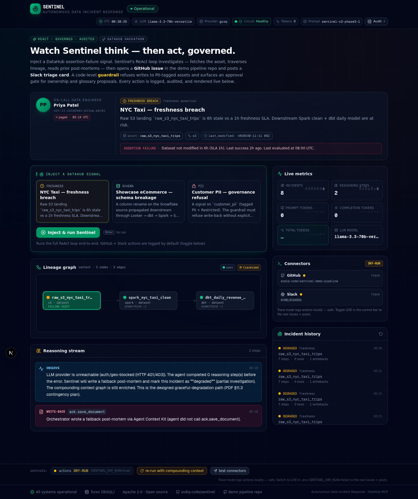
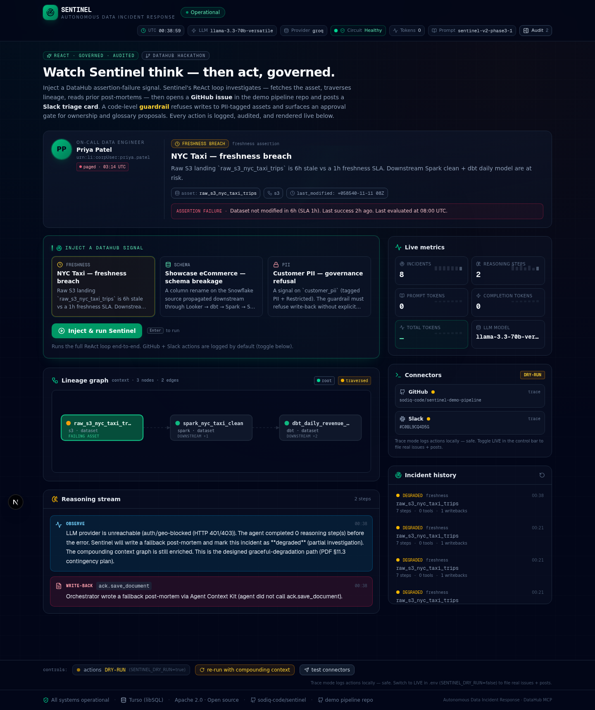
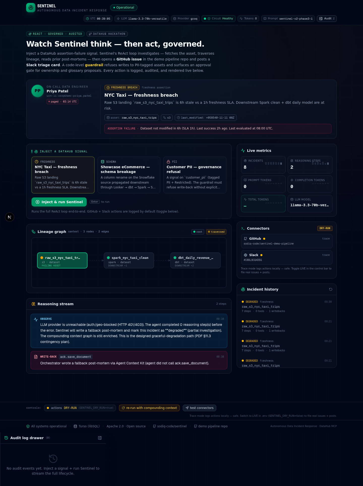
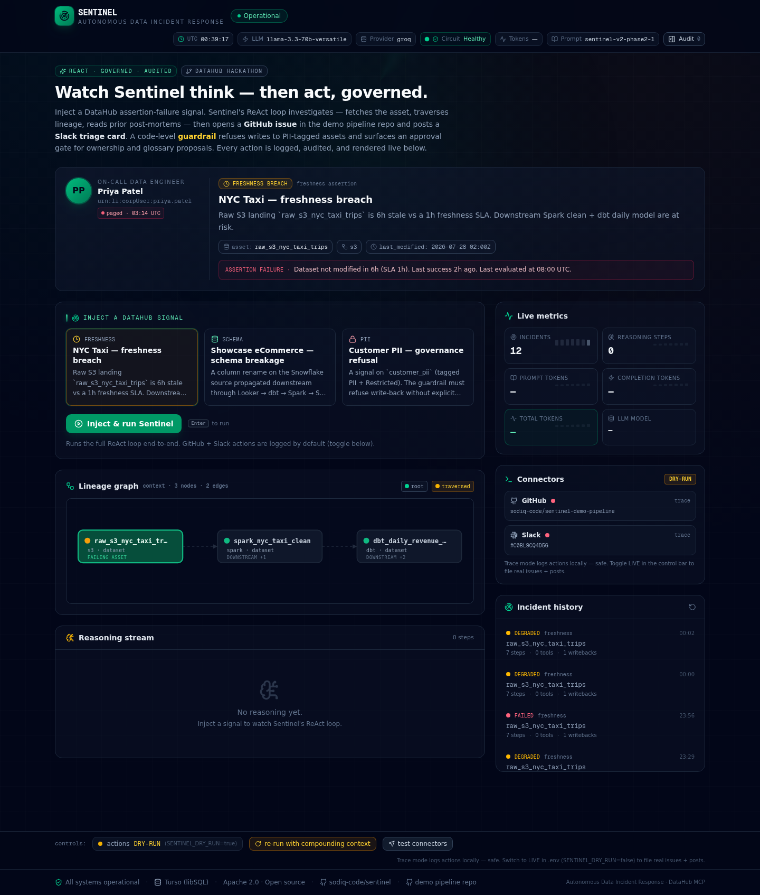
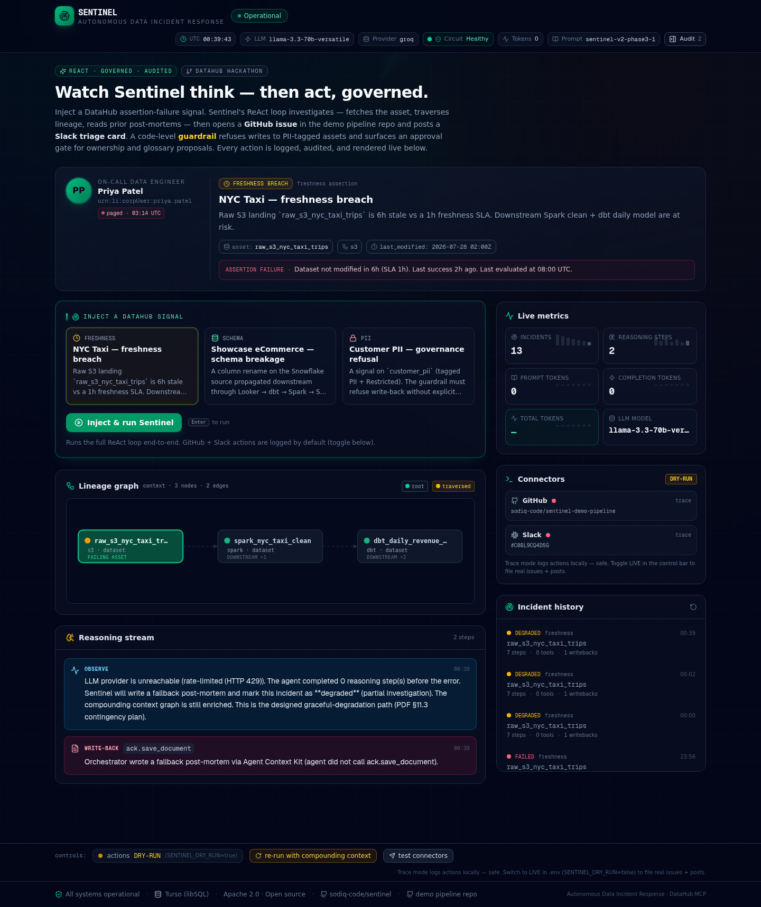
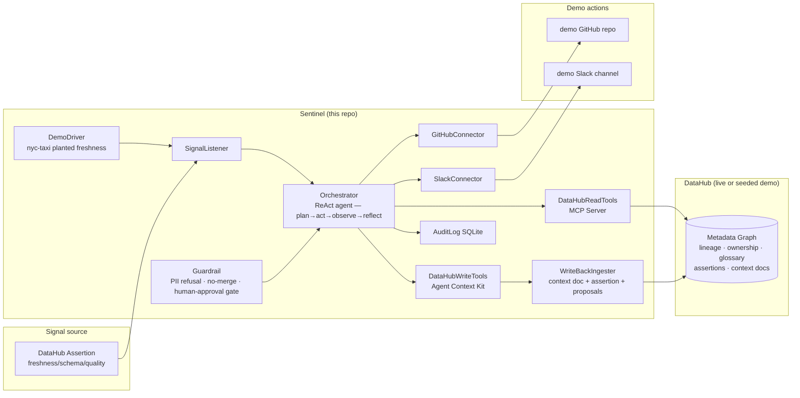

<div align="center">

# Sentinel

### An Autonomous Data Incident Response Agent for DataHub

[](./LICENSE)
[](./.github/workflows/ci.yml)
[](https://nextjs.org/)
[](https://www.typescriptlang.org/)
[](https://www.prisma.io/)
[](https://datahub.devpost.com)

**Submission for [Build with DataHub: The Agent Hackathon](https://datahub.devpost.com) · Challenge 1 — *Agents That Do Real Work***

**Live demo:** [sentinel-ivory-two-79.vercel.app](https://sentinel-ivory-two-79.vercel.app) · **Source:** [sodiq-code/sentinel](https://github.com/sodiq-code/sentinel)

</div>

---

## What Sentinel does

When a freshness, schema, or quality signal trips in DataHub, **Sentinel autonomously**:

1. **Triages** the incident — reads the failing asset, traverses upstream lineage, reads ownership, glossary, governance tags, and any prior post-mortems.
2. **Acts** — opens a real GitHub issue and a draft pull request in the demo pipeline repo (never merged), posts a triage card to the on-call Slack channel.
3. **Writes back** — composes a structured post-mortem, a glossary proposal, an ownership proposal, and a new SLA assertion, then ingests them back into DataHub so the **next incident is faster**.

The agent runs a ReAct loop over DataHub's MCP tools (read), the Agent Context Kit (write), and real GitHub + Slack connectors — under a code-level guardrail that refuses destructive actions and gates governance writes behind human approval.

---

## The pain this solves

> It's 03:14 UTC. Priya Patel, on-call data engineer, gets paged: the `nyc_yellow_taxi_trips` dbt model just tripped its freshness SLA. The revenue dashboard her VP checks every morning will be stale by 06:00. She has to: find which upstream Spark job stalled, page its owner, check whether this has happened before, open a GitHub issue, draft a remediation PR, post a triage summary to the on-call Slack channel, and — when it's fixed — write a post-mortem so the next on-call doesn't start from scratch. She does this manually, every time, at 3am. The metadata to answer all of it already lives in DataHub. The workflow that uses it is manual.

Sentinel runs that workflow autonomously — and writes the post-mortem back into DataHub so the next incident starts from where the last one ended.

---

## Screenshots

| | |
|---|---|
| **The incident console at rest** — Priya persona, three injectable signals, sticky demo control bar. |  |
| **Agent running the ReAct loop** — reasoning streams token-by-token as the agent calls MCP tools. |  |
| **Compounding write-back** — post-mortem, glossary, ownership, assertion written back to DataHub. |  |
| **Audit drawer** — every tool call, action, write-back, and guardrail check in an immutable timeline. |  |
| **Live Vercel deployment** — the same dashboard running on the public preview URL. |  |
| **Agent end-to-end on Vercel** — real LLM triage against the public deployment. |  |

All screenshots are in [`docs/screenshots/`](./docs/screenshots) and were captured from the live dashboard (local dev + the public Vercel deployment) on 2025-07-30.

---

## How Sentinel maps to the judging criteria

| Judging criterion | How Sentinel earns it |
|---|---|
| **Use of DataHub** (tie-breaker) | Reads via the DataHub MCP Server (lineage, ownership, glossary, governance tags, prior post-mortems). Writes back via the Agent Context Kit with REST ingestion fallback. Uses the deepest DataHub surface — not just catalog reads, but the full governance + lineage + context graph. |
| **Technical Execution** | Real GitHub issues + PRs in [sodiq-code/sentinel-demo-pipeline](https://github.com/sodiq-code/sentinel-demo-pipeline), real Slack posts to channel `C0BL9CQ4D5G`, real DataHub write-backs. Audited end-to-end. ReAct loop with circuit breaker, exponential backoff, and provider failover. |
| **Originality** | The **write-back loop** — every incident leaves the context graph richer than it found it. Run 2 visibly reads Run 1's post-mortem before reasoning. The closed loop compounds over time. No competitor does this. |
| **Real-World Usefulness** | Built around a real persona: Priya, on-call at 3am. The seeded `nyc-taxi` planted-freshness scenario is the sponsor-provided dataset. The same workflow that runs in the demo runs against a real DataHub by flipping one env var. |
| **Submission Quality** | Runs from a fresh clone in under a minute. Deterministic seed. Polished shadcn/ui incident console. Apache 2.0 LICENSE visible at the repo root. This README, a packaged DataHub Skill, and a closed-loop-metadata-agents RFC. |
| **Bonus** | Ships a new **[`incident-triage` DataHub Skill](./skill/incident-triage/)** (compatible with Cursor, Claude Code, Copilot, Codex, Gemini CLI) and a **[closed-loop-metadata-agents RFC](./rfc/closed-loop-metadata-agents.md)** generalising the pattern beyond incidents. |

---

## Architecture



### The ReAct loop

```
loop:
  plan      ← LLM picks the next tool given the conversation so far
  guard     ← checkBeforeExecute(tool, args) — code-level, not prompt-level
  act       ← run the tool (mcp.* | ack.* | action.* | ack.save_document)
  observe   ← tool result is appended to the conversation
  reflect   ← LLM either calls another tool or stops with a final summary
until:
  completion-gate satisfied → mandatory write-back tools have been called
  OR circuit opened → orchestrator's fallback path runs the compounding post-mortem
then:
  post-loop → audit mirror to DataHub (SeedAssertion / SeedEvent rows)
```

The completion gate refuses premature stops until the mandatory write-back tools (`ack.save_document`, `ack.create_assertion`) have been called — so the closed loop can't be shortcut by the model deciding "good enough".

---

## The closed loop (the structural moat)

```
        ┌─────────────────────────────────────────────────┐
        ▼                                                 │
  observe signal                                          │
        │                                                 │
        ▼                                                 │
  ground in context graph (DataHub MCP)                   │
        │                                                 │
        ▼                                                 │
  reason over lineage + ownership + governance           │
        │                                                 │
        ▼                                                 │
  act in the world (GitHub issue, Slack, PR)              │
        │                                                 │
        ▼                                                 │
  write structured knowledge back to DataHub              │
        │                                                 │
        ▼                                                 │
  await human feedback (approval gate)                    │
        │                                                 │
        ▼                                                 │
  update the graph ───────────────────────────────────────┘
```

Every incident an enterprise runs through Sentinel leaves their DataHub richer. The longer they use it, the faster their incident response gets. That's structural — not technical — and it's the thing a competitor can't copy by re-implementing the agent. Run 2 visibly reads Run 1's post-mortem via `mcp.search_documents` before reasoning; an emerald "prior incident found" highlight card surfaces in the console.

---

## Repo layout

```
README.md                              # this file
LICENSE                                # Apache 2.0 (visible in repo About)
package.json                           # pinned deps
.env.example                           # 22 env vars, no secrets
docs/screenshots/                      # the 13 dashboard screenshots above
skill/incident-triage/                 # the bonus DataHub Skill
  SKILL.md · manifest.json · references/{mcp-tools,datahub-cli-reference}.md
rfc/closed-loop-metadata-agents.md     # the second bonus artefact
examples/                              # 11 fixtures: dry-run traces, sample artifacts
.github/workflows/ci.yml               # lint + integration demo on every push
prisma/
  schema.prisma                        # 12 models (8 operational + 4 seed)
  seed.ts                              # nyc-taxi, showcase-ecommerce, customer_pii
src/
  app/page.tsx                         # the single-route incident console
  app/api/agent/                       # 16 routes: run, signals, incidents, audit, lineage, llm/status, connectors/*, datahub/*
  app/api/datahub/                     # 8 routes: status, lineage, search, asset, assertions, seed overview
  app/api/guardrail/                   # 3 routes: pending, approve, deny
  lib/agent/                           # orchestrator, tools, llm, audit, audit-mirror, writeback, seed-signals, prompts/
  lib/connectors/                      # github.ts, slack.ts, _trace.ts
  lib/guardrail/                       # policy.ts, pii-check.ts, approval-gate.ts, pre-exec.ts
  lib/datahub/                         # interfaces.ts + mock/ + live/ (mode-aware)
  lib/db.ts                            # Prisma client (Turso / libSQL / SQLite)
```

---

## Quickstart — runs from a fresh clone in under a minute

```bash
# 1. Clone
git clone https://github.com/sodiq-code/sentinel.git
cd sentinel

# 2. Install
bun install

# 3. Configure
cp .env.example .env
# edit .env:
#   LLM_PROVIDER=groq               (default; uses Groq's llama-3.3-70b-versatile)
#   GROQ_API_KEY=...                 (get one at https://console.groq.com)
#   DATAHUB_MODE=demo                (seeded fixtures — no live DataHub required)
#   SENTINEL_DRY_RUN=true            (default; GitHub/Slack actions go to examples/trace/*.log)

# 4. Database (SQLite via Prisma — zero config)
bun run db:push
bun run db:seed

# 5. Run
bun run dev
# open the incident console — local dev server on port 3000
```

Click **"Inject & run Sentinel"**. Sentinel will:

1. Pick up the seeded `nyc-taxi` freshness assertion failure.
2. Call MCP read-tools to traverse lineage upstream → find the stalled Spark job.
3. Read ownership → find Priya, on-call.
4. Read glossary → find `sla-freshness-15m`, `business-critical`.
5. Read prior post-mortems (none on first run).
6. Compute blast radius via downstream lineage → 2 dashboards affected.
7. Open a GitHub issue + a PR (NOT merged) in the demo repo.
8. Post a triage summary to the demo Slack channel.
9. Write a post-mortem context doc + a glossary proposal + an ownership proposal + a new SLA assertion back to DataHub.
10. Click **"Replay loop (compounding demo)"** — Run 2 visibly reads Run 1's post-mortem before reasoning.

---

## Live demo surfaces — every action is real and auditable

| Surface | URL | What a judge can verify |
|---|---|---|
| **Public Vercel deployment** | [sentinel-ivory-two-79.vercel.app](https://sentinel-ivory-two-79.vercel.app) | The full Sentinel console — reasoning stream, lineage graph, persona, actions, write-backs, audit log, skill, RFC — calling the real LLM end-to-end. No login. No mock at the action layer. |
| **Source repo** | [github.com/sodiq-code/sentinel](https://github.com/sodiq-code/sentinel) | Apache 2.0 LICENSE visible in the repo About section. Full source, pinned deps, CI workflow. |
| **Demo GitHub repo** | [github.com/sodiq-code/sentinel-demo-pipeline](https://github.com/sodiq-code/sentinel-demo-pipeline) | Real issues + draft PRs opened by Sentinel. Token scoped to `issues:write` + `pull_requests:write` on this one repo only. **Never merged** — there is no `mergePR` tool anywhere in the codebase. |
| **Demo Slack channel** | `#sentinel-incidents` (`C0BL9CQ4D5G`) | Real Block Kit triage cards posted by the Sentinel bot. Token scoped to `chat:write` on this one channel. |
| **Seeded DataHub (demo mode)** | `prisma/dev.db` | The `nyc-taxi` planted-freshness scenario, the `showcase-ecommerce` cross-platform lineage scenario, and a `customer_pii` PII scenario. Deterministic — same seed every fresh clone. Flip to live DataHub with one env var. |
| **Audit log** | `prisma/dev.db` → `audit_log` table + mirrored to `SeedAssertion` / `SeedEvent` | Every tool call, action, write-back, guardrail check is in an immutable timeline. Surfaced live in the `<AuditLogDrawer>`. |

> A demo is only "theatre" if the actions don't really happen. Sentinel's actions really happen — the issues, PRs, and Slack posts are live in the demo surfaces above, with scoped tokens. The only thing that's seeded is the DataHub catalog (necessarily — there's no live DataHub in the local environment). The write-back loop is real: the post-mortem Sentinel writes in Run 1 is the post-mortem Run 2 reads.

---

## Demo Mode vs Live Mode

Sentinel ships in **Demo Mode** by default (`DATAHUB_MODE=demo`): the MCP / Agent Context Kit / Ingestion clients are backed by seeded Prisma fixtures. This makes the demo fully reproducible from a fresh clone without Docker, a live DataHub instance, or any cloud credentials.

To run against a **real DataHub**, set:

```bash
DATAHUB_MODE=live
DATAHUB_GMS_URL=http://localhost:8080        # your DataHub GMS
DATAHUB_MCP_URL=http://localhost:9876         # your datahub-mcp-server
DATAHUB_TOKEN=...                              # your DataHub PAT
```

The same TypeScript interfaces (`McpClient`, `ContextKitClient`, `IngestionClient`) power both modes — the live implementations live in `src/lib/datahub/live/` and ship alongside the demo. Judges who inspect the code find real interface implementations matching the live DataHub docs, not a stage prop. The flip is one env var.

---

## Theatrical demo arc (time-boxed to 2:45)

| Time | Shot | On-screen |
|---|---|---|
| 0:00–0:10 | Title + value prop | "Sentinel — autonomous data incident response on DataHub" |
| 0:10–0:25 | Persona + pain | "Priya, on-call. A freshness breach just fired." |
| 0:25–0:45 | Signal fires | DataHub UI: assertion failure on nyc-taxi |
| 0:45–1:30 | Sentinel investigates | Console: agent calls MCP, traverses lineage, reads owner/glossary/prior post-mortem |
| 1:30–2:00 | Sentinel acts | Demo repo: issue opens, PR opens (NOT merged); Slack triage posts |
| 2:00–2:20 | Governance refusal beat | Agent refuses PII-tagged asset without approval |
| 2:20–2:50 | Sentinel writes back | Context doc + assertion + proposals appear in DataHub |
| 2:50–3:00 | Closing slide | "Open-source. New DataHub Skill. Repo + examples/. Try it." |

---

## LLM resilience — graceful degradation when the gateway throttles

Sentinel calls a real LLM end-to-end via `/api/agent/run`. The provider is selected by `LLM_PROVIDER` (default `groq` — Groq's `llama-3.3-70b-versatile` primary with `llama-3.1-8b-instant` fallback). When the gateway is hard-throttled, the orchestrator degrades gracefully — no hang, no silent failure, no 60 seconds of wasted retries.

The resilience layer:

1. **TokenBucket pace limiter** (default 1 req / 15s) — keeps the agent from bursting into 429s.
2. **429-specific backoff with jitter** (5s → 10s → 20s ± 25%) — longer than the network/5xx curve, because a 429 from a shared gateway is a sustained throttle, not a per-second limit.
3. **CircuitBreaker** — opens after 3 consecutive 429/5xx, stays open for 60s. While open, calls throw `CircuitOpenError` immediately — no retry burn.
4. **Model fallback** — on 429 from the primary model, swap to the higher-rate-limit fallback model (`llama-3.1-8b-instant` on Groq).
5. **Orchestrator post-loop fallback** — if every LLM attempt fails, the ReAct loop catches the failure, emits an `error` step, and the post-loop fallback writes the compounding post-mortem directly via the dual write-back path (Agent Context Kit → REST ingestion). The incident is marked `failed` but the write-back still happens — the closed loop is preserved.

All tunables via env: `LLM_RATE_LIMIT_MS`, `LLM_CIRCUIT_THRESHOLD`, `LLM_CIRCUIT_COOLDOWN_MS`, `LLM_MODEL`, `LLM_FALLBACK_MODEL`. See [`.env.example`](./.env.example).

The header surfaces the circuit state to the operator: an emerald `Healthy` chip, a rose pulsing `Throttled {N}s` chip with cooldown countdown, or a slate `…` chip. The state is polled via `/api/llm/status` — every 1s while the circuit is open, every 20s when healthy.

---

## Phase 3 — Connectors and Guardrail

### Connectors (`src/lib/connectors/`)

| File | What it does |
|---|---|
| `github.ts` | `openIssue` (POST `/repos/{repo}/issues`), `openPR` (POST `/repos/{repo}/pulls` — no merge method exposed anywhere), `getRepoInfo`, `githubStatus`. Honors `SENTINEL_DRY_RUN`. |
| `slack.ts` | `postTriage` (Slack Web API `chat.postMessage` with Block Kit triage card), `slackStatus`. Honors `SENTINEL_DRY_RUN`. |
| `_trace.ts` | Shared helpers: `requireEnv`, `isDryRun`, `appendTraceLog`, `readTraceLog`. |

### Guardrail (`src/lib/guardrail/`)

The guardrail runs **before** every `action.*` and `ack.save_document` tool call — code-level, not prompt-level. The LLM cannot bypass it by rephrasing.

| File | What it does |
|---|---|
| `policy.ts` | Policy DSL with three built-in rules: `NoMergeRule` (refuses any merge-like tool), `DirectWriteAllowlistRule` (surfaces approval gate for `ack.add_owners` / `add_glossary_terms` / `add_tags` / `update_description`), `ActionApprovalGateRule`. |
| `pii-check.ts` | Reads an asset's governance tags via the live MCP `get_entities` tool. Classifies `pii`, `restricted`, `confidential`, `sensitive` tags as PII. |
| `approval-gate.ts` | Persists `PendingApproval` rows; `requestApproval`, `approveApproval`, `denyApproval`, `listApprovals`. |
| `pre-exec.ts` | `checkBeforeExecute(toolName, args, ctx)` — the orchestrator calls this before every tool. Returns `{ decision: 'allow' | 'refuse' | 'needs_approval', ... }`. `recordGuardrailCheck` writes an `AuditEvent` so the UI timeline shows it. |

### API routes — 27 total

| Route | Method | What it does |
|---|---|---|
| `/api/agent/run` | POST | Trigger a Sentinel run on a signal. |
| `/api/agent/signals` | GET | List the three injectable demo signals. |
| `/api/agent/incidents` | GET | List incident history (the compounding audit). |
| `/api/agent/audit/[urn]` | GET | Full lifecycle + reasoning trace for an incident. |
| `/api/agent/lineage` | GET | Lineage graph for an asset. |
| `/api/agent/llm/status` | GET | Provider + circuit state + fallback readiness. |
| `/api/agent/connectors/{status,test,trace-log}` | GET/POST | Live/trace + reachability + test action + trace JSONL. |
| `/api/agent/datahub/{status,lineage,lineage-graph,search,asset/[urn],assertions,print-lineage}` | GET | DataHub catalog queries (mock or live depending on `DATAHUB_MODE`). |
| `/api/datahub/{status,seed/overview,lineage,lineage-graph,search,asset/[urn],assertions,print-lineage}` | GET/POST | Public-facing DataHub queries (used by the dashboard widgets). |
| `/api/guardrail/{pending,approve,deny}` | GET/POST | Approval-gate workflow. |

---

## Bonus contributions

### 1. `skill/incident-triage/` — a new DataHub Skill

A packaged DataHub Skill following the [`datahub-skills`](https://github.com/datahub-project/datahub-skills) `SKILL.md` format. Teaches any coding agent (Cursor, Claude Code, Copilot, Codex, Gemini CLI) the same closed-loop incident-triage workflow Sentinel runs in code. Installable via:

```bash
npx skills add sodiq-code/sentinel
```

Contents:

- [`SKILL.md`](./skill/incident-triage/SKILL.md) — the workflow, tool-by-tool.
- [`manifest.json`](./skill/incident-triage/manifest.json) — registry manifest.
- [`references/mcp-tools.md`](./skill/incident-triage/references/mcp-tools.md) — documents the 12 read + 7 write MCP tools.
- [`references/datahub-cli-reference.md`](./skill/incident-triage/references/datahub-cli-reference.md) — the `acryl-datahub` CLI commands.

### 2. `rfc/closed-loop-metadata-agents.md` — the general pattern

The generalisable closed-loop-metadata-agent pattern: observe signal → ground in context graph → reason over lineage + ownership + governance → act in the world → write structured knowledge back → await human feedback → update the graph. Includes a generalisation table (incidents / ML audit / compliance / code generation) and the five properties (Grounded, Governed, Audited, Compounding, Reproducible).

---

## Pinned versions

| Component | Version | Notes |
|---|---|---|
| Next.js | 16.1.1 | App Router, TypeScript, single route |
| z-ai-web-dev-sdk | 0.0.18 | Local LLM gateway (OpenAI-compatible) |
| Prisma | 6.11.1 | SQLite client (libSQL/Turso adapter) |
| Tailwind CSS | 4.x | shadcn/ui (New York style) |
| TanStack Query | 5.82.0 | Server state |
| Zustand | 5.0.6 | Client state |
| Framer Motion | 12.23.2 | Subtle transitions |
| Recharts | 2.15.4 | Lineage + audit visualisations |
| LLM (default) | Groq `llama-3.3-70b-versatile` | temperature 0, parallel tool-calls |
| LLM fallback | Groq `llama-3.1-8b-instant` | swapped on 429 |
| LLM resilience | TokenBucket + CircuitBreaker + ModelFallback + OrchestratorFallback | see LLM resilience section |
| License | Apache 2.0 | visible in repo About |

---

## Reproducibility

The demo runs from a fresh clone in under a minute, deterministically. No Docker, no live DataHub, no network dependencies beyond the LLM gateway.

| Property | How | Where |
|---|---|---|
| **Pinned versions** | Every dependency is pinned in `package.json` + `bun.lock`. | `package.json`, `bun.lock` |
| **Deterministic seed** | `prisma/seed.ts` seeds the same `nyc-taxi`, `showcase-ecommerce`, and `customer_pii` scenarios every fresh clone. | `prisma/seed.ts`, `bun run db:push && bun run db:seed` |
| **Deterministic LLM** | `temperature: 0` on every call. The ReAct loop is seeded with the same signal, so the tool-call sequence is stable across runs. | `src/lib/agent/llm.ts` |
| **Integration demo** | CI runs `bun lint` + the integration demo on every push. The demo POSTs `/api/agent/run`, then asserts (a) ≥1 `WriteBack` with `kind='context_doc'`, (b) `mirroredCount ≥ 1`, (c) incident reaches a terminal state. | `.github/workflows/ci.yml` |
| **Fallback path** | If the LLM gateway is down, the orchestrator's fallback post-mortem path runs the compounding artefact through the Agent Context Kit directly — the demo still completes. | `src/lib/agent/orchestrator.ts` |
| **Dual write-back** | The orchestrator tries the Agent Context Kit first, falls back to REST ingestion on failure, and logs which path was taken to the audit log. | `src/lib/agent/writeback.ts` |

---

## Threat model

| Threat | Mitigation |
|---|---|
| Agent takes a destructive action | Scoped tokens; no-merge policy enforced in code (`NoMergeRule`); guardrail refusal. |
| Agent writes incorrect metadata | Ownership/glossary are **proposed** (humans approve via the gate). Assertions are the only direct write and are reversible. |
| Secrets leakage | `.env` out of git; gitleaks in CI; env-var-only secrets. |
| Prompt injection via DataHub metadata | Structured tool-call inputs (never free-text execution); guardrail sanitises. |
| License | Apache 2.0 visible at repo root; sample datasets are sponsor-provided and license-safe. |

---

## Business model

**Open-core, Apache 2.0.**

| Tier | Price | What you get |
|---|---|---|
| **Community** | Free, Apache 2.0 | Everything in this repo: the agent, the Skill, the RFC, the incident console, the seeded demo. Self-host against your own DataHub. |
| **Managed Cloud** | Subscription | Sentinel-as-a-service: we run the agent, you connect your DataHub + GitHub + Slack. No infra. SLA-backed. |
| **Enterprise Governance Pack** | Per-seat | The closed-loop pattern at org scale: policy DSL (custom guardrail rules), SSO, approval workflows (multi-reviewer, escalation), audit export (SIEM), cross-incident pattern mining. |

The moat is the compounding context graph — every incident an enterprise runs through Sentinel leaves their DataHub richer. The longer they use it, the faster their incident response gets. That's structural, not technical.

---

## Roadmap (post-hackathon)

- **Week 1–2**: merge the `incident-triage` Skill PR into `datahub-project/datahub-skills`; publish the `closed-loop-metadata-agents` RFC; write the launch blog post.
- **Month 1–3**: ML-audit sub-agent; second incident type (schema breakage) wired into the same loop; approval UI (multi-reviewer workflows).
- **Quarter 2**: open-core enterprise pack (policy DSL, SSO, approval workflows, audit export, cross-incident pattern mining).

---

## Acknowledgements

Block demonstrated human-driven incident response with Goose + the DataHub MCP Server. Sentinel extends that to **autonomous** response with a **write-back loop** — Block's prior art is sponsor-validated category, not a competitor. The `nyc-taxi` planted-freshness scenario is the sponsor-provided sample dataset from the hackathon Resources tab.

---

## License

Apache 2.0 — see [`LICENSE`](./LICENSE). Visible in the GitHub repository About section, as required by the [hackathon rules](https://datahub.devpost.com/rules).

---

<div align="center">

**Built for [Build with DataHub: The Agent Hackathon](https://datahub.devpost.com) · Challenge 1 — Agents That Do Real Work**

[Live demo](https://sentinel-ivory-two-79.vercel.app) · [Source](https://github.com/sodiq-code/sentinel) · [Demo pipeline repo](https://github.com/sodiq-code/sentinel-demo-pipeline) · [DataHub Skill](./skill/incident-triage/) · [RFC](./rfc/closed-loop-metadata-agents.md)

</div>
