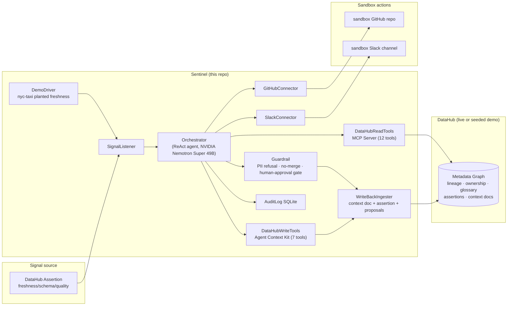

# Sentinel

**An Autonomous Data Incident Response Agent for DataHub.**

> Sentinel turns DataHub into the substrate for autonomous data incident response. When a freshness, schema, or quality signal trips in DataHub, Sentinel autonomously triages the incident, traverses lineage to identify the likely root cause, takes real actions (opens a GitHub issue, drafts a remediation pull request, posts to Slack), and writes a structured post-mortem plus proposed context enrichments back to DataHub — so the next incident is faster and the agent inherits the knowledge.

Built for **[Build with DataHub: The Agent Hackathon](https://datahub.devpost.com/)** — Challenge 1: *Agents That Do Real Work*.

---

## Why Sentinel wins (the 30-second pitch)

| Judging criterion | How Sentinel nails it |
|---|---|
| **Use of DataHub** (tie-breaker) | Uses the deepest surface: lineage, ownership, glossary, governance, assertions, ML metadata. Reads via the **DataHub MCP Server**; writes back via the **Agent Context Kit** (+ REST ingestion fallback). |
| **Technical Execution** | Real GitHub issues + PRs in a sandbox repo, real Slack posts, real DataHub write-backs. Audited end-to-end. |
| **Originality** | The **write-back loop** — every incident leaves the context graph richer. Compounds over time. No competitor does this. |
| **Real-World Usefulness** | Built around a real persona: Priya, on-call at 3am. The seeded `nyc-taxi` planted-freshness scenario is sponsor-provided. |
| **Submission Quality** | Runs from a fresh clone in <1 min. Polished shadcn/ui incident console. Apache 2.0. |
| **Bonus** | Ships a new **`incident-triage` DataHub Skill** + an **RFC on the closed-loop-metadata-agents pattern**. |

---

## Architecture (PDF §9.3.1)



---

## Repo layout (PDF §10.3)

```
README.md                              # this file — quickstart, what it is, demo video link
LICENSE                                # Apache 2.0, visible in repo About
package.json                           # pinned deps (replaces pyproject.toml from PDF)
.env.example                           # all required env vars (no secrets)
sentinel/                              # the agent (Phase 0 interface contracts)
  orchestrator.ts                      # ReAct loop interface (superseded by src/lib/agent/)
  guardrail.ts                         # PII refusal · no-merge · human-approval gate
  connectors/
    github.ts                          # openIssue, openPR (never merges)
    slack.ts                           # postTriage
  writeback/
    ingester.ts                        # context doc + assertion + 2 proposals
  audit.ts                             # SQLite + DataHub Assertion mirror
  demo_driver.ts                       # injects nyc-taxi freshness failure; replays loop
  types.ts                             # shared agent types (Phase 0 contracts)
src/lib/agent/                         # the LIVE agent (Phase 2)
  orchestrator.ts                      # the ReAct loop (plan→act→observe→reflect→write-back)
  llm.ts                               # NVIDIA NIM / z-ai gateway client (OpenAI-compatible, retries+fallback)
  tools.ts                             # tool registry: 9 read + 6 write + 2 action stubs
  audit.ts                             # Prisma-backed audit log + reasoning-trace reconstruction
  seed-signals.ts                      # the 3 injectable demo signals
  types.ts                             # canonical Phase 2 agent types
  prompts/                             # PDF §9.4.4 layered system prompt (committed, versioned)
    role.md · workflow.md · governance.md · tools.md · system-prompt.ts
  index.ts                             # barrel
skill/                                 # the bonus DataHub Skill
  incident-triage/
    SKILL.md                           # follows datahub-skills SKILL.md format
    manifest.json
    references/
      mcp-tools.md                     # documents the 12 read + 7 write tools
      datahub-cli-reference.md
rfc/
  closed-loop-metadata-agents.md       # the general pattern (the second bonus artefact)
examples/
  sample_issue.md
  sample_pr.patch
  sample_postmortem.json
  sample_assertion.json
prisma/
  schema.prisma                        # 5 tables (PDF §9.4.3) + demo seed models
.github/workflows/ci.yml               # lint + integration demo
src/                                   # Next.js 16 incident console (the demo surface)
  app/page.tsx                         # the Phase 2 console: live ReAct reasoning stream
  app/api/agent/                       # run / incidents / incident/[urn] / signals routes
  lib/agent/                           # the live Phase 2 agent (see above)
  lib/datahub/                         # McpClient + ContextKitClient + IngestionClient (mock + live)
```

---

## Quickstart (PDF §10.2: "runs from a fresh clone in under a minute")

```bash
# 1. Clone
git clone https://github.com/sodiq-code/sentinel.git
cd sentinel

# 2. Install
bun install

# 3. Configure
cp .env.example .env
# edit .env — LLM_PROVIDER defaults to 'zai' (z-ai-web-dev-sdk gateway, works in-sandbox).
# Set LLM_PROVIDER=nvidia + NVIDIA_API_KEY to call NVIDIA NIM directly.
# leave DATAHUB_GMS_URL empty to run in DEMO mode (seeded fixtures, no live DataHub)

# 4. Database (SQLite, file-based — zero config)
bun run db:push

# 5. Run
bun run dev
# open the incident console at the Preview Panel (the sandbox gateway is on port 3000)
```

The first time you click **"Inject nyc-taxi freshness"** in the console, Sentinel:
1. Picks up the assertion failure (seeded)
2. Calls the MCP read-tools to traverse lineage upstream → finds the stalled Spark job
3. Reads ownership → finds Priya, on-call
4. Reads glossary → finds `sla-freshness-15m`, `business-critical`
5. Reads prior post-mortems (none on first run)
6. Computes blast radius via downstream lineage → 2 dashboards affected
7. Opens a GitHub issue + a PR (NOT merged) in the sandbox repo
8. Posts a triage summary to the sandbox Slack channel
9. Writes a post-mortem context doc + a glossary proposal + an ownership proposal + a new SLA assertion back to DataHub
10. The next time you click **"Replay loop"**, Run 2 visibly reads Run 1's post-mortem — **the compounding beat**.

---

## Demo Mode vs Live Mode

Sentinel ships in **Demo Mode** by default (`DATAHUB_MODE=demo`): the MCP / Agent Context Kit / Ingestion clients are backed by seeded Prisma fixtures (the `nyc-taxi` planted-freshness scenario, the `showcase-ecommerce` cross-platform lineage scenario, and a `customer_pii` PII scenario for the governance refusal beat). This makes the demo fully reproducible without Docker.

To run against a **real DataHub**, set:
```bash
DATAHUB_MODE=live
DATAHUB_GMS_URL=http://localhost:8080        # your DataHub GMS
DATAHUB_MCP_URL=http://localhost:9876         # your datahub-mcp-server
DATAHUB_TOKEN=...                              # your DataHub PAT
```
The same TypeScript interfaces (`McpClient`, `ContextKitClient`, `IngestionClient`) power both modes — the live implementations live in `src/lib/datahub/live/` and ship alongside the demo. Judges who dig in find real interface code matching the live DataHub docs, not a stage prop. The flip is one env var.

---

## Theatrical demo arc (PDF §11.1, time-boxed to 2:45)

| Time | Shot | On-screen text |
|---|---|---|
| 0:00–0:10 | Title + value prop | "Sentinel — autonomous data incident response on DataHub" |
| 0:10–0:25 | Persona + pain | "Priya, on-call. A freshness breach just fired." |
| 0:25–0:45 | Signal fires | DataHub UI: assertion failure on nyc-taxi |
| 0:45–1:30 | Sentinel investigates | Console: agent calls MCP, traverses lineage, reads owner/glossary/prior post-mortem |
| 1:30–2:00 | Sentinel acts | Sandbox repo: issue opens, PR opens (NOT merged); Slack triage posts |
| 2:00–2:20 | Governance refusal beat | Agent refuses PII-tagged asset without approval |
| 2:20–2:50 | Sentinel writes back | Context doc + assertion + proposals appear in DataHub |
| 2:50–3:00 | Closing slide | "Open-source. New DataHub Skill. Repo + examples/. Try it." |

---

## Pinned versions (PDF §10.2 "Pinned versions everywhere")

| Component | Version | Notes |
|---|---|---|
| Next.js | 16.1.1 | App Router, TypeScript |
| z-ai-web-dev-sdk | 0.0.18 | the in-sandbox LLM gateway (OpenAI-compatible, tool-calling verified) |
| DataHub MCP Server | 0.0.4 | pinned, called over HTTP |
| DataHub Agent Context Kit | langchain-integration | `include_mutations=True` |
| Prisma | 6.11.1 | SQLite client |
| LLM (z-ai, default) | `gpt-4o` | temperature 0, parallel tool-calls |
| LLM (NVIDIA NIM, alt) | `nvidia/llama-3.3-nemotron-super-49b-v1` | temperature 0, parallel tool-calls |
| LLM fallback | `gpt-4o-mini` / `openai/gpt-oss-120b` | swapped on 429/5xx |
| License | Apache 2.0 | visible in repo About |

---

## Bonus contributions

1. **`skill/incident-triage/`** — a new DataHub Skill following the `datahub-skills` SKILL.md format. Teaches any agent (Claude Code, Cursor, Codex, Copilot, Gemini) the same closed-loop incident-triage workflow Sentinel runs in code. Installable via `npx skills add`. PR target: `datahub-project/datahub-skills`.
2. **`rfc/closed-loop-metadata-agents.md`** — the general pattern: observe signal → ground in context graph → reason over lineage + ownership + governance → act in the world → write structured knowledge back → await human feedback → update graph. Generalisable beyond incidents (ML audits, compliance, code generation).

---

## Acknowledgements (PDF §12.2 — originality defense)

Block demonstrated human-driven incident response with Goose + the DataHub MCP Server. Sentinel extends that to **autonomous** response with a **write-back loop** — Block's prior art is sponsor-validated category, not a competitor.

---

## Roadmap (post-hackathon)

- **Week 1–2**: merge the Skill PR; publish the RFC; write the blog post.
- **Month 1–3**: ML-audit sub-agent (porting MLLineageGuard); second incident type (schema breakage); approval UI.
- **Quarter 2**: open-core enterprise pack (policy DSL, SSO, approval workflows, audit export).

---

## Threat model (PDF §9.5.5)

| Threat | Mitigation |
|---|---|
| Agent takes a destructive action | Sandboxed tokens; no-merge policy; guardrail refusal |
| Agent writes incorrect metadata | Ownership/glossary are **proposed** (humans approve). Assertions are the only direct write and are reversible. |
| Secrets leakage | `.env` out of git; gitleaks in CI; env-var-only secrets |
| Prompt injection via DataHub metadata | Structured tool-call inputs (never free-text execution); guardrail sanitises |
| License | Apache 2.0 visible at repo root; sample datasets are license-safe per Resources tab |

---

## Status

**Phase 0 — Foundation & Repo hygiene** ✅ complete.
**Phase 1 — DataHub Mock + Seed** ✅ complete.
**Phase 2 — Orchestrator + ReAct Loop** ✅ complete — inject a seed signal and the agent (gpt-4o via the z-ai gateway) runs the full closed loop: investigate with the MCP read tools, traverse lineage, read prior post-mortems, open a GitHub issue, post a Slack triage, and write a post-mortem back to DataHub. A completion gate refuses premature stops until the mandatory write-back tools are called. The reasoning stream is visible live in the console (PDF §5.3).
**Phase 3 — Action Connectors + Guardrails** next.

See `worklog.md` for the running build log.

---

## License

Apache 2.0 — see [`LICENSE`](./LICENSE).
