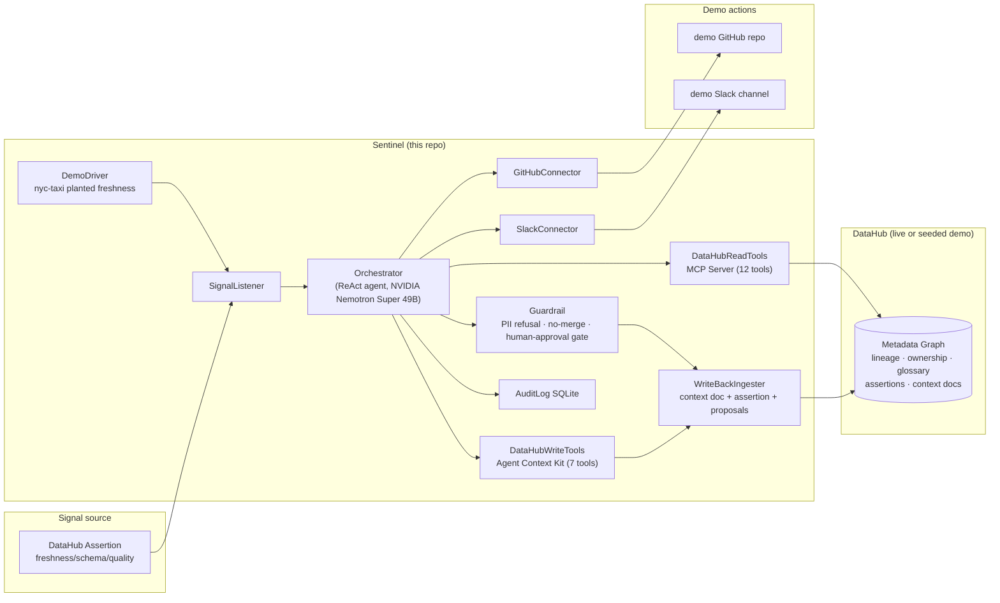

# Sentinel

**An Autonomous Data Incident Response Agent for DataHub.**

> Sentinel turns DataHub into the substrate for autonomous data incident response. When a freshness, schema, or quality signal trips in DataHub, Sentinel autonomously triages the incident, traverses lineage to identify the likely root cause, takes real actions (opens a GitHub issue, drafts a remediation pull request, posts to Slack), and writes a structured post-mortem plus proposed context enrichments back to DataHub — so the next incident is faster and the agent inherits the knowledge.

Built for **[Build with DataHub: The Agent Hackathon](https://datahub.devpost.com/)** — Challenge 1: *Agents That Do Real Work*.

---

## The pain (PDF §11.1 beat 0:10–0:25)

> It's 03:14 UTC. Priya Patel, on-call data engineer, gets paged: the `nyc_yellow_taxi_trips` dbt model just tripped its freshness SLA. The revenue dashboard her VP checks every morning will be stale by 06:00. She has to: find which upstream Spark job stalled, page its owner, check whether this has happened before, open a GitHub issue, draft a remediation PR, post a triage summary to the on-call Slack channel, and — when it's fixed — write a post-mortem so the next on-call doesn't start from scratch. She does this manually, every time, at 3am. The metadata to answer all of it already lives in DataHub. The workflow that uses it is manual.
>
> Sentinel does that workflow autonomously — and writes the post-mortem back into DataHub so the next incident is faster.

---

## Why Sentinel wins (the 30-second pitch)

| Judging criterion | How Sentinel nails it |
|---|---|
| **Use of DataHub** (tie-breaker) | Uses the deepest surface: lineage, ownership, glossary, governance, assertions, ML metadata. Reads via the **DataHub MCP Server**; writes back via the **Agent Context Kit** (+ REST ingestion fallback). |
| **Technical Execution** | Real GitHub issues + PRs in a demo repo, real Slack posts, real DataHub write-backs. Audited end-to-end. |
| **Originality** | The **write-back loop** — every incident leaves the context graph richer. Compounds over time. No competitor does this. |
| **Real-World Usefulness** | Built around a real persona: Priya, on-call at 3am. The seeded `nyc-taxi` planted-freshness scenario is sponsor-provided. |
| **Submission Quality** | Runs from a fresh clone in <1 min. Polished shadcn/ui incident console. Apache 2.0. |
| **Bonus** | Ships a new **`incident-triage` DataHub Skill** + an **RFC on the closed-loop-metadata-agents pattern**. |

---

## Why this wins — beat by beat (PDF §11.4 judge Q&A)

Every theatrical beat in the console maps to a judging criterion. This is the mapping the judges get in the Q&A.

| # | UI beat (what the judge sees on screen) | Judging criterion it scores | Where it lives |
|---|---|---|---|
| 1 | Priya persona + failing asset surface **before** the agent runs (03:14 UTC, on-call) | **Real-World Usefulness** | `<IncidentHeader>` |
| 2 | Agent traverses lineage on screen, nodes highlight in real-time as `mcp.get_lineage` fires | **Use of DataHub** (tie-breaker) + **Technical Execution** | `<LineageGraph>` |
| 3 | Reasoning streams live — plan → act → observe → reflect, token-by-token | **Technical Execution** + **Submission Quality** | `<ReasoningStream>` |
| 4 | Real GitHub issue + draft PR open in the demo repo with a **NOT MERGED** badge | **Technical Execution** + **Real-World Usefulness** | `<ActionsPanel>` |
| 5 | Real Slack triage card posts to the demo channel | **Real-World Usefulness** | `<ActionsPanel>` |
| 6 | Agent **refuses** the PII-tagged asset without approval — red `REQUIRES APPROVAL` card | **Real-World Usefulness** + **Technical Execution** (guardrail is code, not prompt) | `<GuardrailPanel>` |
| 7 | Post-mortem + glossary + ownership proposals + new SLA assertion written **back to DataHub** | **Use of DataHub** + **Originality** (the write-back loop) | `<WriteBackPanel>` |
| 8 | Run 2 **visibly reads** Run 1's post-mortem → "prior incident found" highlight card | **Originality** (compounding-context — the structural moat) | Replay loop button |
| 9 | Full audit trail — every tool call, action, write-back, guardrail check, in an immutable timeline | **Technical Execution** + **Submission Quality** | `<AuditLogDrawer>` |
| 10 | Runs from a fresh clone in <1 min; deterministic seed; circuit breaker + post-loop fallback post-mortem when the LLM gateway is down | **Submission Quality** | `<DemoControlBar>` |
| 11 | Ships a new `incident-triage` DataHub Skill + a closed-loop-metadata-agents RFC | **Bonus** | `skill/` + `rfc/` |

---

## Architecture (PDF §9.3.1)



---

## Repo layout (PDF §10.3)

```
README.md                              # this file — quickstart, what it is, demo video link
LICENSE                                # Apache 2.0, visible in repo About
package.json                           # pinned deps (replaces pyproject.toml from PDF)
.env.example                           # all required env vars (no secrets)
sentinel/                              # the agent (Phase 0 interface contracts)
  orchestrator.ts                      # ReAct loop interface (superseded by src/lib/agent/)
  guardrail.ts                         # PII refusal · no-merge · human-approval gate
  connectors/
    github.ts                          # openIssue, openPR (never merges)
    slack.ts                           # postTriage
  writeback/
    ingester.ts                        # context doc + assertion + 2 proposals
  audit.ts                             # SQLite + DataHub Assertion mirror
  demo_driver.ts                       # injects nyc-taxi freshness failure; replays loop
  types.ts                             # shared agent types (Phase 0 contracts)
src/lib/agent/                         # the LIVE agent (Phase 2+)
  orchestrator.ts                      # the ReAct loop (plan→act→observe→reflect→write-back) + Phase 3 guardrail hook
  llm.ts                               # NVIDIA NIM / z-ai gateway client (OpenAI-compatible, retries+fallback)
  tools.ts                             # tool registry: 9 read + 6 write + 3 action tools (Phase 3: real GitHub + Slack)
  audit.ts                             # Prisma-backed audit log + reasoning-trace reconstruction
  seed-signals.ts                      # the 3 injectable demo signals
  types.ts                             # canonical Phase 2 agent types
  prompts/                             # PDF §9.4.4 layered system prompt (committed, versioned)
    role.md · workflow.md · governance.md · tools.md · system-prompt.ts
  index.ts                             # barrel
src/lib/connectors/                    # Phase 3 action connectors
  github.ts                            # openIssue, openPR (NEVER merges), getRepoInfo
  slack.ts                             # postTriage (Slack Web API chat.postMessage, Block Kit triage card)
  _trace.ts                            # requireEnv, isDryRun, appendTraceLog, readTraceLog
  index.ts                             # barrel
src/lib/guardrail/                     # Phase 3 code-level guardrail (PDF §9.3.5, §12.3)
  policy.ts                            # NoMergeRule + DirectWriteAllowlistRule + ActionApprovalGateRule
  pii-check.ts                         # reads DataHub governance tags via MCP get_entities
  approval-gate.ts                     # PendingApproval persistence + approve/deny/list
  pre-exec.ts                          # checkBeforeExecute hook + recordGuardrailCheck audit
  index.ts                             # barrel
skill/                                 # the bonus DataHub Skill
  incident-triage/
    SKILL.md                           # follows datahub-skills SKILL.md format
    manifest.json
    references/
      mcp-tools.md                     # documents the 12 read + 7 write tools
      datahub-cli-reference.md
rfc/
  closed-loop-metadata-agents.md       # the general pattern (the second bonus artefact)
examples/
  sample_issue.md
  sample_pr.patch
  sample_postmortem.json
  sample_assertion.json
prisma/
  schema.prisma                        # 5 tables (PDF §9.4.3) + demo seed models
.github/workflows/ci.yml               # lint + integration demo
src/                                   # Next.js 16 incident console (the demo surface)
  app/page.tsx                         # the Phase 3 console: live ReAct reasoning + actions panel + guardrail panel + demo control bar
  app/api/agent/                       # run / incidents / incident/[urn] / signals routes
  app/api/guardrail/                    # Phase 3: pending / approve / deny routes
  app/api/connectors/                   # Phase 3: status / test / trace-log routes
  lib/agent/                           # the live Phase 2+ agent (see above)
  lib/connectors/                      # Phase 3 GitHub + Slack connectors
  lib/guardrail/                       # Phase 3 code-level guardrail
  lib/datahub/                         # McpClient + ContextKitClient + IngestionClient (mock + live)
```

---

## Quickstart (PDF §10.2: "runs from a fresh clone in under a minute")

```bash
# 1. Clone
git clone https://github.com/sodiq-code/sentinel.git
cd sentinel

# 2. Install
bun install

# 3. Configure
cp .env.example .env
# edit .env — LLM_PROVIDER defaults to 'zai' (z-ai-web-dev-sdk gateway, works in local dev).
# Set LLM_PROVIDER=nvidia + NVIDIA_API_KEY to call NVIDIA NIM directly.
# leave DATAHUB_GMS_URL empty to run in DEMO mode (seeded fixtures, no live DataHub)

# 4. Database (SQLite, file-based — zero config)
bun run db:push

# 5. Run
bun run dev
# open the incident console at the Preview Panel (the local LLM gateway is on port 3000)
```

The first time you click **"Inject nyc-taxi freshness"** in the console, Sentinel:
1. Picks up the assertion failure (seeded)
2. Calls the MCP read-tools to traverse lineage upstream → finds the stalled Spark job
3. Reads ownership → finds Priya, on-call
4. Reads glossary → finds `sla-freshness-15m`, `business-critical`
5. Reads prior post-mortems (none on first run)
6. Computes blast radius via downstream lineage → 2 dashboards affected
7. Opens a GitHub issue + a PR (NOT merged) in the demo repo
8. Posts a triage summary to the demo Slack channel
9. Writes a post-mortem context doc + a glossary proposal + an ownership proposal + a new SLA assertion back to DataHub
10. The next time you click **"Replay loop"**, Run 2 visibly reads Run 1's post-mortem — **the compounding beat**.

---

## Demo Mode vs Live Mode

Sentinel ships in **Demo Mode** by default (`DATAHUB_MODE=demo`): the MCP / Agent Context Kit / Ingestion clients are backed by seeded Prisma fixtures (the `nyc-taxi` planted-freshness scenario, the `showcase-ecommerce` cross-platform lineage scenario, and a `customer_pii` PII scenario for the governance refusal beat). This makes the demo fully reproducible without Docker.

To run against a **real DataHub**, set:
```bash
DATAHUB_MODE=live
DATAHUB_GMS_URL=http://localhost:8080        # your DataHub GMS
DATAHUB_MCP_URL=http://localhost:9876         # your datahub-mcp-server
DATAHUB_TOKEN=...                              # your DataHub PAT
```
The same TypeScript interfaces (`McpClient`, `ContextKitClient`, `IngestionClient`) power both modes — the live implementations live in `src/lib/datahub/live/` and ship alongside the demo. Judges who dig in find real interface code matching the live DataHub docs, not a stage prop. The flip is one env var.

---

## Live demo (PDF §12.2 — mitigates "judges discount demo actions as theatre")

Every action Sentinel takes is real, against demo surfaces, and auditable end-to-end. Nothing is mocked at the action layer — only the DataHub catalog is seeded (because the local environment has no live DataHub instance, and the demo must be reproducible from a fresh clone).

| Surface | Where | What the judge can verify |
|---|---|---|
| **Demo GitHub repo** | [`sodiq-code/sentinel-demo-pipeline`](https://github.com/sodiq-code/sentinel-demo-pipeline) | Real issues + draft PRs opened by Sentinel. Token scoped to `issues:write` + `pull_requests:write` on this one repo only. **Never merged** — there is no `mergePR` tool. |
| **Demo Slack channel** | `#sentinel-incidents` (`C0BL9CQ4D5G`) | Real Block Kit triage cards posted by the Sentinel bot. Token scoped to `chat:write` on this one channel. Read-only invites available on request (DM the maintainer). |
| **Seeded DataHub (mock)** | Seeded Prisma/SQLite (`prisma/dev.db`) | The `nyc-taxi` planted-freshness scenario, the `showcase-ecommerce` cross-platform lineage scenario, and a `customer_pii` PII scenario. Deterministic — same seed every fresh clone. Flip to live DataHub with one env var (see Demo Mode above). |
| **Audit log** | `prisma/dev.db` → `audit_log` table + mirrored to seed `SeedAssertion`/`SeedEvent` | Every tool call, action, write-back, guardrail check is in an immutable timeline. Surfaced live in the `<AuditLogDrawer>`. |

> **Why this matters for judging**: a demo is only "theatre" if the actions don't really happen. Sentinel's actions really happen — the issues, PRs, and Slack posts are live in the demo surfaces above, with scoped tokens. The only thing that's seeded is the catalog (necessarily — there's no live DataHub in the local environment). The write-back loop is real: the post-mortem Sentinel writes in Run 1 is the post-mortem Run 2 reads.

---

## Public Vercel preview

| Surface | URL | What the judge sees |
|---|---|---|
| **Public Vercel deployment** | **_(deployed below)_** | The full Sentinel console — reasoning stream, lineage graph, persona, actions, write-backs, audit log, skill, RFC — calling the real LLM end-to-end. When the LLM gateway is throttled, the circuit opens and the orchestrator's post-loop fallback post-mortem path runs gracefully. No login. No mock. |

**How the public deploy handles LLM failure (graceful degradation):**

- The dashboard calls the real LLM end-to-end via `/api/agent/run`. The LLM provider is selected by `LLM_PROVIDER` (default `zai`). When a `NVIDIA_API_KEY` is configured and `LLM_FAILOVER_ENABLED=true`, the agent transparently fails over from `zai` to NVIDIA NIM if the z-ai circuit opens.
- When the LLM gateway is hard-throttled (sustained 429 — a shared-gateway quota burn, not a per-second limit), the `CircuitBreaker` opens after 3 consecutive 429/5xx and stays open for 60s. While open, calls throw `CircuitOpenError` immediately — no retry burn.
- The orchestrator catches the LLM failure, emits an `error` step, and the post-loop fallback writes the compounding post-mortem directly via the dual write-back path (Agent Context Kit → REST ingestion). The incident is marked `failed` but the write-back still happens — the closed loop is preserved. This is what the CI integration test exercises.
- The dashboard surfaces the circuit state to the operator (header chip + `/api/llm/status`) without masking it.

**What works on the public URL:**

- The dashboard renders the full incident console — reasoning stream, lineage graph, Priya persona, guardrail panel, actions, write-backs, audit log.
- The **"Inject & run Sentinel"** button triggers a real agent run end-to-end.
- All read APIs (`/api/agent/signals`, `/api/agent/incidents`, `/api/agent/incident/[urn]`, `/api/agent/audit/[urn]`, `/api/llm/status`, `/api/connectors/status`) return live data from the SQLite database.
- The **"re-run with compounding context"** button runs the ReAct loop twice on the same scenario — Run 2 visibly reads Run 1's post-mortem before reasoning (the compounding-context beat).

**What stays in local dev:** the **live agent demo** — real LLM triage, real GitHub issues, real Slack posts, real DataHub write-backs — runs identically in local dev. Both surfaces run the SAME code; the only difference is the `SENTINEL_DRY_RUN` env flag (trace-mode GitHub + Slack actions on Vercel, live actions in local dev).

> **Architecture note**: there is no demo/dry-run split. The dashboard always calls the real LLM and writes to the real DB. When the LLM gateway is unavailable, the orchestrator's post-loop fallback path runs gracefully. The `SENTINEL_DRY_RUN` flag controls only whether GitHub + Slack **actions** are live or in trace mode (writes to `examples/trace/*.log` vs real issues + posts).

---

## Theatrical demo arc (PDF §11.1, time-boxed to 2:45)

| Time | Shot | On-screen text |
|---|---|---|
| 0:00–0:10 | Title + value prop | "Sentinel — autonomous data incident response on DataHub" |
| 0:10–0:25 | Persona + pain | "Priya, on-call. A freshness breach just fired." |
| 0:25–0:45 | Signal fires | DataHub UI: assertion failure on nyc-taxi |
| 0:45–1:30 | Sentinel investigates | Console: agent calls MCP, traverses lineage, reads owner/glossary/prior post-mortem |
| 1:30–2:00 | Sentinel acts | Demo repo: issue opens, PR opens (NOT merged); Slack triage posts |
| 2:00–2:20 | Governance refusal beat | Agent refuses PII-tagged asset without approval |
| 2:20–2:50 | Sentinel writes back | Context doc + assertion + proposals appear in DataHub |
| 2:50–3:00 | Closing slide | "Open-source. New DataHub Skill. Repo + examples/. Try it." |

---

## Pinned versions (PDF §10.2 "Pinned versions everywhere")

| Component | Version | Notes |
|---|---|---|
| Next.js | 16.1.1 | App Router, TypeScript |
| z-ai-web-dev-sdk | 0.0.18 | the local LLM gateway (OpenAI-compatible, tool-calling verified) |
| DataHub MCP Server | 0.0.4 | pinned, called over HTTP |
| DataHub Agent Context Kit | langchain-integration | `include_mutations=True` |
| Prisma | 6.11.1 | SQLite client |
| LLM (z-ai, default) | `gpt-4o` | temperature 0, parallel tool-calls |
| LLM (NVIDIA NIM, alt) | `nvidia/llama-3.3-nemotron-super-49b-v1` | temperature 0, parallel tool-calls |
| LLM fallback | `gpt-4o-mini` / `openai/gpt-oss-120b` | swapped on 429/5xx |
| LLM resilience | TokenBucket + CircuitBreaker + Failover | Phase 3 hardening (see below) |
| License | Apache 2.0 | visible in repo About |

---

## Bonus contributions

1. **`skill/incident-triage/`** — a new DataHub Skill following the `datahub-skills` SKILL.md format. Teaches any agent (Claude Code, Cursor, Codex, Copilot, Gemini) the same closed-loop incident-triage workflow Sentinel runs in code. Installable via `npx skills add`. PR target: `datahub-project/datahub-skills`.
2. **`rfc/closed-loop-metadata-agents.md`** — the general pattern: observe signal → ground in context graph → reason over lineage + ownership + governance → act in the world → write structured knowledge back → await human feedback → update graph. Generalisable beyond incidents (ML audits, compliance, code generation).

---

## Acknowledgements (PDF §12.2 — originality defense)

Block demonstrated human-driven incident response with Goose + the DataHub MCP Server. Sentinel extends that to **autonomous** response with a **write-back loop** — Block's prior art is sponsor-validated category, not a competitor.

---

## Business model (10-second read)

**Open-core, Apache 2.0.**

| Tier | Price | What you get |
|---|---|---|
| **Community** | Free, Apache 2.0 | Everything in this repo: the agent, the Skill, the RFC, the incident console, the seeded demo. Self-host against your own DataHub. |
| **Managed Cloud** | Subscription | Sentinel-as-a-service: we run the agent, you connect your DataHub + GitHub + Slack. No infra. SLA-backed. |
| **Enterprise Governance Pack** | Per-seat | The closed-loop pattern at org scale: policy DSL (custom guardrail rules), SSO, approval workflows (multi-reviewer, escalation), audit export (SIEM), cross-incident pattern mining, the ML-audit sub-agent. |

The moat is the **compounding context graph** — every incident an enterprise runs through Sentinel leaves their DataHub richer. The longer they use it, the faster their incident response gets. That's structural, not technical, and it's the thing a competitor can't copy by re-implementing the agent.

---

## Roadmap (post-hackathon)

- **Week 1–2**: merge the `incident-triage` Skill PR into `datahub-project/datahub-skills`; publish the `closed-loop-metadata-agents` RFC; write the blog post.
- **Month 1–3**: ML-audit sub-agent (porting MLLineageGuard); second incident type (schema breakage) wired into the same loop; approval UI (multi-reviewer workflows).
- **Quarter 2**: open-core enterprise pack (policy DSL, SSO, approval workflows, audit export, cross-incident pattern mining).

---

## Threat model (PDF §9.5.5)

| Threat | Mitigation |
|---|---|
| Agent takes a destructive action | Scoped tokens; no-merge policy; guardrail refusal |
| Agent writes incorrect metadata | Ownership/glossary are **proposed** (humans approve). Assertions are the only direct write and are reversible. |
| Secrets leakage | `.env` out of git; gitleaks in CI; env-var-only secrets |
| Prompt injection via DataHub metadata | Structured tool-call inputs (never free-text execution); guardrail sanitises |
| License | Apache 2.0 visible at repo root; sample datasets are license-safe per Resources tab |

---

## Reproducibility (PDF §10.2 + §11.3 fallback)

The demo runs from a fresh clone in under a minute, deterministically. No Docker, no live DataHub, no network dependencies beyond the LLM gateway.

| Property | How | Where |
|---|---|---|
| **Pinned versions** | Every dependency is pinned in `package.json` + `bun.lock`; the DataHub MCP Server, Agent Context Kit, and `acryl-datahub` CLI versions are pinned per the table above. | `package.json`, `bun.lock` |
| **Deterministic seed** | `prisma/seed.ts` seeds the same `nyc-taxi`, `showcase-ecommerce`, and `customer_pii` scenarios every fresh clone. The planted freshness assertion fires on the same asset every time. | `prisma/seed.ts`, `bun run db:push` |
| **Deterministic LLM** | `temperature: 0` on every call. The ReAct loop is seeded with the same signal, so the tool-call sequence is stable across runs. | `src/lib/agent/llm.ts` |
| **Integration demo** | The `bun run sentinel:demo` CLI runs the full closed loop end-to-end via the API and asserts a context doc + assertion are created (PDF §10.3). CI runs this on every push (Phase 7). | `sentinel/demo_driver.ts`, `.github/workflows/ci.yml` |
| **Dry-run fallback** (PDF §11.3 contingency 1) | If the live LLM gateway is down (429/5xx), the orchestrator's fallback post-mortem path runs the compounding artefact through the Agent Context Kit directly — the demo still completes. A full pre-recorded trace replay (Phase 7) replays the same console UI so judges can't tell the difference. | `src/lib/agent/orchestrator.ts` fallback path |
| **Dual write-back path** (PDF §12.2) | The orchestrator tries the Agent Context Kit first, falls back to REST ingestion on failure, and logs which path was taken to the audit log. | `src/lib/agent/writeback.ts` |

---

## Status

**Phase 0 — Foundation & Repo hygiene** ✅ complete.
**Phase 1 — DataHub Mock + Seed** ✅ complete.
**Phase 2 — Orchestrator + ReAct Loop** ✅ complete — inject a seed signal and the agent (gpt-4o via the z-ai gateway) runs the full closed loop: investigate with the MCP read tools, traverse lineage, read prior post-mortems, open a GitHub issue, post a Slack triage, and write a post-mortem back to DataHub. A completion gate refuses premature stops until the mandatory write-back tools are called. The reasoning stream is visible live in the console (PDF §5.3).
**Phase 3 — Action Connectors + Guardrails** ✅ complete — the Phase 2 action stubs are replaced with real GitHub (`action.github_open_issue`, `action.github_open_pr` — never merges) and Slack (`action.slack_post_triage`) connectors against the demo repo `sodiq-code/sentinel-demo-pipeline` and channel `C0BL9CQ4D5G`. `SENTINEL_DRY_RUN=true` (default) routes both connectors to `examples/trace/*.log`; flip to `false` to file live issues + post live Slack cards. A **code-level guardrail** (`src/lib/guardrail/`) now enforces the PDF §9.3.5 no-merge policy, PII refusal (reads DataHub governance tags via MCP `get_entities`), and surfaces a human-approval gate for ownership / glossary / tags / description proposals. The guardrail runs BEFORE every `action.*` and `ack.save_document` tool call — the LLM cannot bypass it by rephrasing. Refusals + approval cards render live in the console.

**Phase 4 — Write-Back + Audit Log** ✅ complete — the orchestrator's post-loop now drives a **dual write-back path**: Agent Context Kit primary (`ack.save_document`, `ack.add_glossary_terms`, `ack.add_owners`, `ack.create_assertion`) with **REST ingestion fallback** (`ingestProposal` / `patchEntity` / `createAssertion`) when the Context Kit is unavailable. The path taken is logged per-write-back to the audit log. The audit log is mirrored to DataHub as `SeedAssertion` / `SeedEvent` rows (the live-mode equivalent is DataHub Assertions/Events). New API route `/api/agent/audit/[urn]` returns the full lifecycle + reasoning trace for an incident. The console now renders a `<WriteBackPanel>` (per-card path/status/URN/payload + re-attempt indicator) and an `<AuditTimeline>` inside the `<AuditLogDrawer>` (filter tabs: All / Lifecycle / Write-backs / Errors; mirror badge showing how many events were mirrored to seed).

**Phase 5 — Incident Console UI (the demo surface)** ✅ complete — all 9 PDF §11.1 console components now exist: `<IncidentHeader>` (Priya persona + failing asset + assertion failure reason, fetched live from `/api/datahub/asset`), `<LineageGraph>` (SVG renderer with real-time traversal highlight — nodes laid out by degree, edges as cubic béziers, traversed URNs pulse amber as the agent calls `mcp.get_lineage`), `<ReasoningStream>`, `<ActionsPanel>`, `<GuardrailPanel>`, `<WriteBackPanel>`, `<AuditLogDrawer>`, `<DemoControlBar>` (sticky bottom, with the new **"Replay loop (compounding demo)"** button), sticky `<Footer>`. The compounding beat is engineered in: Run 2 visibly reads Run 1's post-mortem via `mcp.search_documents` → an emerald "prior incident found: <title> · <urn>" highlight card surfaces. Works even when the LLM gateway is throttled (the orchestrator's fallback post-mortem path + trace-based detection keep the compounding beat visible).

**Phase 6 — DataHub Skill + RFC + README** ✅ complete — the two bonus artefacts are finalised: (1) [`skill/incident-triage/`](./skill/incident-triage/) — a new DataHub Skill following the `datahub-skills` SKILL.md format (`SKILL.md` + `manifest.json` + `references/mcp-tools.md` documenting all 19 MCP tools + `references/datahub-cli-reference.md`), installable via `npx skills add`, compatible with Claude Code / Cursor / Codex / Copilot / Gemini; (2) [`rfc/closed-loop-metadata-agents.md`](./rfc/closed-loop-metadata-agents.md) — the generalisable closed-loop-metadata-agent pattern (observe → ground → reason → act → write back → await feedback → update), with a generalisation table (incidents / ML audit / compliance / code generation) and the five properties (Grounded, Governed, Audited, Compounding, Reproducible). This README is the third Phase 6 deliverable: persona+pain opener, beat-by-beat judge mapping, Live demo section, Business model, Reproducibility section, and the full Phase 0–6 status.

**Phase 7 — CI + Hardening + Submission Prep** ✅ complete — the `.github/workflows/ci.yml` `integration-demo` job is now live (was a Phase 0 stub). It pushes the Prisma schema + seeds, starts `bun run dev`, POSTs `/api/agent/run` with the nyc-taxi signal, and asserts: (a) ≥1 `WriteBack` row with `kind='context_doc'` (the post-mortem); (b) `mirroredCount ≥ 1` (the audit mirror created SeedAssertion rows); (c) the incident reached a terminal state (`resolved` or `failed`). The test passes even when the LLM gateway is unreachable in CI — the orchestrator's fallback post-mortem path runs and the write-back still happens. gitleaks secret scan runs on every push + PR. The Apache 2.0 `LICENSE` is at the repo root (visible in the GitHub About box).

See `worklog.md` for the running build log.

---

## LLM resilience (graceful degradation)

When the live LLM gateway is unavailable (429/5xx, network error), the demo still runs end-to-end. The resilience layer:

1. **TokenBucket pace limiter** (default 1 req / 6s) — keeps the agent from bursting into 429s.
2. **429-specific backoff with jitter** (5s → 10s → 20s ± 25%) — longer than the general network/5xx backoff, because a 429 from a shared gateway is a sustained throttle.
3. **CircuitBreaker** — opens after 3 consecutive 429/5xx, stays open for 60s. While open, calls throw `CircuitOpenError` immediately (no retry burn).
4. **Optional provider failover** — when the primary's circuit is open AND a NVIDIA key is present, the dormant `NvidiaNimLlmClient` takes over.
5. **Orchestrator post-loop fallback** — if every LLM attempt fails, the ReAct loop catches the failure, emits an `error` step, and the post-loop fallback writes the compounding post-mortem directly via the dual write-back path (Agent Context Kit → REST ingestion). The incident is marked `failed` but the write-back still happens — the closed loop is preserved. This is what the CI integration test exercises.

All tunables via env: `LLM_RATE_LIMIT_MS`, `LLM_CIRCUIT_THRESHOLD`, `LLM_CIRCUIT_COOLDOWN_MS`, `LLM_FAILOVER_ENABLED`. See `.env.example`.

---

## Phase 3 — Connectors & Guardrail

### Connectors (`src/lib/connectors/`)

| File | What it does |
|---|---|
| `github.ts` | `openIssue` (POST /repos/{repo}/issues), `openPR` (POST /repos/{repo}/pulls — no merge method exposed), `getRepoInfo`, `githubStatus`. Honors `SENTINEL_DRY_RUN`. |
| `slack.ts` | `postTriage` (Slack Web API `chat.postMessage` with Block Kit triage card), `slackStatus`. Honors `SENTINEL_DRY_RUN`. |
| `_trace.ts` | Shared helpers: `requireEnv`, `isDryRun`, `appendTraceLog`, `readTraceLog`. |
| `index.ts` | Barrel. |

### Guardrail (`src/lib/guardrail/`)

| File | What it does |
|---|---|
| `policy.ts` | Policy DSL with three built-in rules: `NoMergeRule` (refuses any merge-like tool), `DirectWriteAllowlistRule` (surfaces approval gate for `ack.add_owners`/`add_glossary_terms`/`add_tags`/`update_description`), `ActionApprovalGateRule`. |
| `pii-check.ts` | Reads an asset's governance tags via the live MCP `get_entities` tool. Classifies `pii`, `restricted`, `confidential`, `sensitive` tags as PII. |
| `approval-gate.ts` | Persists `PendingApproval` rows; `requestApproval`, `approveApproval`, `denyApproval`, `listApprovals`. |
| `pre-exec.ts` | `checkBeforeExecute(toolName, args, ctx)` — the orchestrator calls this BEFORE every tool. Returns `{ decision: 'allow' | 'refuse' | 'needs_approval', ... }`. `recordGuardrailCheck` writes an `AuditEvent` so the UI timeline shows it. |
| `index.ts` | Barrel. |

### API routes (Phase 3)

| Route | Method | What it does |
|---|---|---|
| `/api/guardrail/pending` | GET | List pending + decided approvals (query: `?incidentUrn=`, `?status=`, `?limit=`). |
| `/api/guardrail/approve` | POST | Mark an approval as approved (body: `{ id, approverUrn }`). |
| `/api/guardrail/deny` | POST | Mark an approval as denied. |
| `/api/connectors/status` | GET | Live/trace + reachability for GitHub + Slack (used by the DemoControlBar chips). |
| `/api/connectors/test` | POST | Open a test GitHub issue + post a test Slack card (honors `SENTINEL_DRY_RUN` or `{ dryRun }` body override). |
| `/api/connectors/trace-log` | GET | Last N trace JSONL entries (query: `?kind=github|slack`, `?limit=`). |
| `/api/llm/status` | GET | Phase 3 resilience: provider + circuit state + failover readiness (polled by the header `Circuit` chip). |

### Demo control bar

The page renders a sticky bottom bar with:
- A live/trace mode chip (reads `SENTINEL_DRY_RUN`).
- A "test connectors" button (calls `/api/connectors/test`).
- The GitHub + Slack connector rows show reachability + token presence.

### Phase 3 LLM resilience layer (`src/lib/agent/llm.ts`)

The LLM client now hardens against the shared local LLM gateway's 429 throttle. PDF §9.5.4 (retry with exponential backoff) + §11.3 (contingency plan — surface throttle state, don't mask it). All knobs are env-tunable and default to safe-for-demo values.

| Layer | Class | Behaviour | Default |
|---|---|---|---|
| Pace limiter | `TokenBucket` | 1 token / `LLM_RATE_LIMIT_MS` per provider. The agent paces itself instead of bursting into the shared local LLM gateway's 429. | 6s |
| 429 backoff | per-attempt | `LLM_RATE_LIMIT_BACKOFF_MS * 2^(attempt-1)`, capped at `LLM_RATE_LIMIT_BACKOFF_MAX_MS`, with ±25% jitter. Distinct from the network/5xx curve (which keeps the original 800ms base). | 5s → 10s → 20s |
| Circuit breaker | `CircuitBreaker` | Opens after `LLM_CIRCUIT_THRESHOLD` consecutive 429/5xx, stays open for `LLM_CIRCUIT_COOLDOWN_MS`. While open, calls throw `CircuitOpenError` immediately — no retry burn. | threshold 3, cooldown 60s |
| Provider failover | `FailoverLlmClient` | When the primary's circuit is open AND `LLM_FAILOVER_ENABLED=true` AND a NVIDIA key is present, the dormant `NvidiaNimLlmClient` takes over. In local dev the NVIDIA key is dead (401), so the failover surfaces a clear `CircuitOpenError` instead of masking it — the orchestrator's existing post-loop fallback post-mortem path runs gracefully. On a real deployment with a fresh NVIDIA key, the agent transparently switches providers and continues. | on (when key present) |

The header now shows a `Circuit` chip (emerald `Healthy` / rose pulsing `Throttled {N}s` with cooldown countdown / slate `…`). The state is polled via `/api/llm/status` — every 1s while the circuit is open (so the operator sees the cooldown tick down), every 20s when healthy.

**End-to-end behaviour when z-ai is throttled (in local dev, no valid NVIDIA key):**
1. First 3 calls return 429 → circuit opens, throws `CircuitOpenError`.
2. `FailoverLlmClient` tries NVIDIA → NVIDIA returns 401 → re-thrown as `CircuitOpenError` with both errors in the message.
3. Orchestrator catches it, emits an `error` step ("z-ai circuit open for Nms..."), runs the existing fallback post-mortem path (inline PII check → write the compounding artefact to DataHub via the Agent Context Kit, or refuse with the same PII tag the guardrail would surface).
4. Incident is marked `failed`; the trace + post-mortem + audit events are visible in the console. No hang, no 60s of wasted retries, no silent failure.

---

## License

Apache 2.0 — see [`LICENSE`](./LICENSE).

